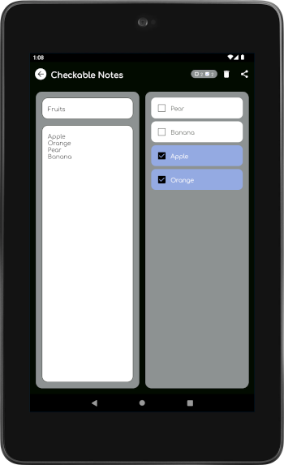

# Checkable Notes
Transform a single note of newline separated items into a checkable list. The checked items go to the bottom of the list with the unchecked ones bubbling up.

## Features

- Lightweight (<2MB).
- No sign-in needed.
- Shows counts of completed as well as pending items.
- Adaptive layout that adjusts according to available screen space.

## Screenshots

##  Android app on Google Play

